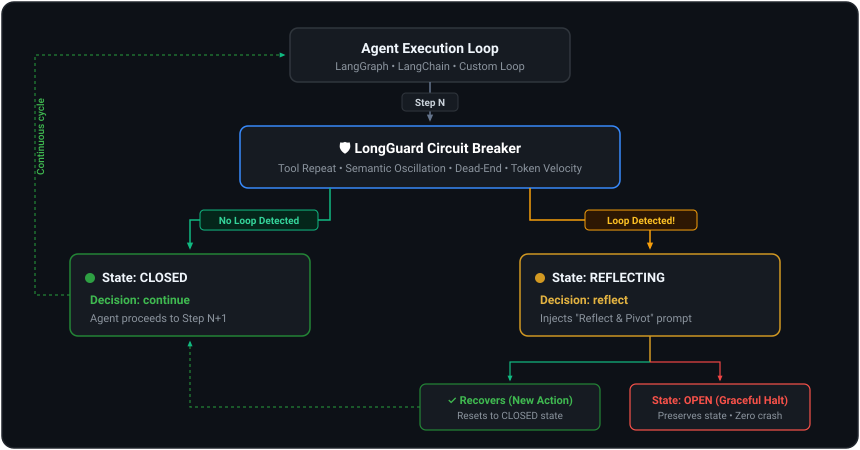

# How It Works: Circuit Breaker State Machine

LongGuard borrows the classic **Circuit Breaker** pattern from distributed systems (like Netflix Hystrix) and reimagines it for LLM cognitive reasoning.

---

## The 4-State Automaton

On every step of an agent's run, LongGuard checks all registered loop detectors and navigates a state machine:

### 1. `CLOSED` (Normal Operation)
- The agent is executing without detected loops or abnormal token spikes.
- All detectors run concurrently in sub-milliseconds.
- Every check returns `BreakerDecision(action="continue")`.

### 2. `REFLECTING` (First Loop Detected)
- A detector has identified a loop pattern with high confidence (e.g. 3 identical searches in a row).
- Instead of terminating the agent, LongGuard injects a **Reflect & Pivot** system prompt into the agent context.
- Returns `BreakerDecision(action="reflect", inject_prompt="...")`.

### 3. `HALF_OPEN` (The Recovery Window)
- The agent has been prompted to pivot.
- LongGuard monitors the next step:
  - **Success:** If the agent switches strategies or makes meaningful progress, the breaker resets back to `CLOSED`.
  - **Failure:** If the agent ignores the prompt and repeats the bad pattern, the breaker trips to `OPEN`.

### 4. `OPEN` (Graceful Termination)
- The agent was unable to recover.
- LongGuard kills the agent cleanly:
  - Saves the entire message history and conversation state.
  - Appends an explanatory AI message to the state so the user isn't left with a broken error.
  - Finalizes the `GuardReport` with exact timestamps, steps, and kill reasons.

---

## Hard Caps

In addition to loop detection, LongGuard enforces hard safety caps that bypass the state machine:
- **Token Budget (`max_tokens_per_run`):** Trips immediately if total query tokens exceed the threshold (e.g. 50,000 tokens).
- **Step Limit (`max_steps`):** Trips immediately if total reasoning steps exceed the threshold (e.g. 25 steps).
